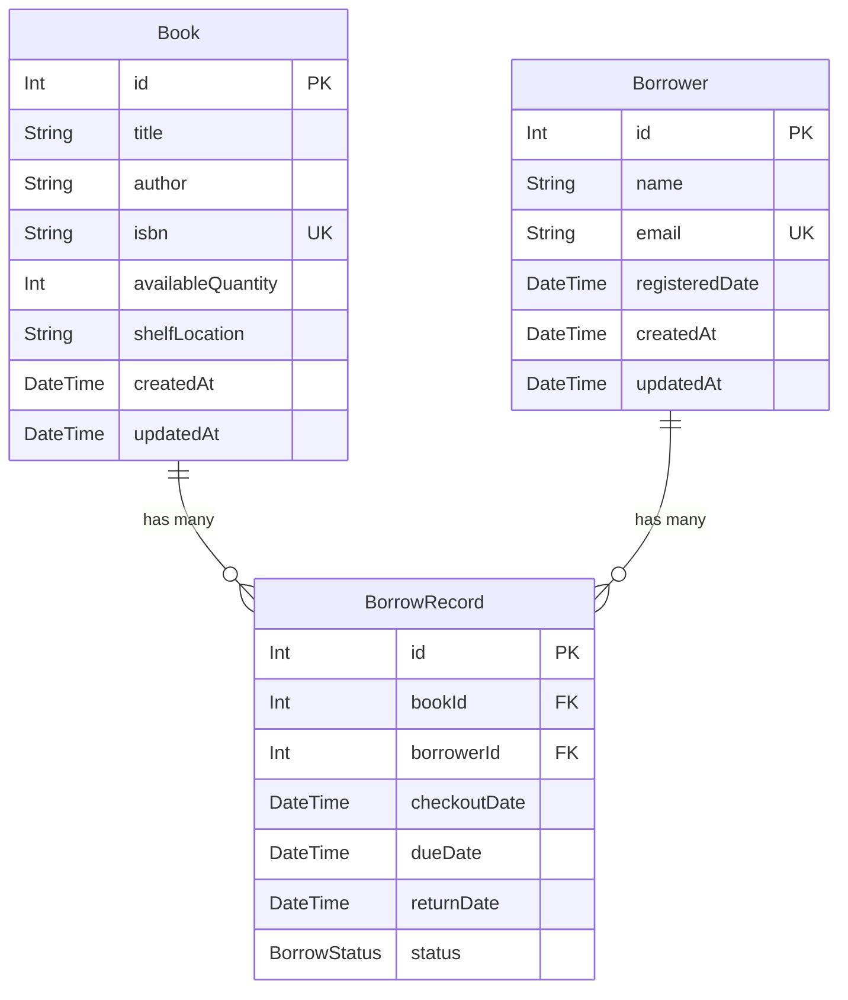

# 📚 Library Management System


A robust RESTful API built to manage a modern library's core operations: Books, Borrowers, and the Borrowing workflow. Developed as a technical assessment for **Bosta**.

---

## 🚀 Key Features

*   **📖 Books Management**: Full CRUD with advanced search by title, author, or ISBN. Paginated list responses.
*   **👥 Borrower Management**: Registration, profile updates, removal, and paginated listing.
*   **🔄 Borrowing Process**: Checkout and return flows using **Prisma Database Transactions** for inventory integrity. Overdue tracking and per-borrower book lists.
*   **📊 Analytical Reports (Bonus)**: Export borrowing data and overdue records as **CSV** or **Excel (.xlsx)**. Supports custom date ranges via `startDate` / `endDate` query parameters (defaults to last month).
*   **🛡️ Security & Scalability (Bonus)**:
    *   **Rate Limiting**: `@nestjs/throttler` applied globally and per-endpoint.
    *   **Basic Authentication**: Protects the Books API via custom guards.
    *   **Data Validation**: Strict input validation using class-validator pipes.
    *   **Deletion Guards**: Books currently checked out and borrowers with unreturned books cannot be deleted — the API returns a clear `400 Bad Request`.
*   **📄 Advanced Pagination**: All `GET` list endpoints accept `?page=1&limit=10` query parameters and return a standardized metadata envelope:
    ```json
    {
      "data": [ ... ],
      "total": 42,
      "page": 1,
      "limit": 10,
      "totalPages": 5
    }
    ```

## 🏗️ Non-Functional Requirements (NFRs)

The system is designed with strict adherence to architectural best practices concerning performance, scalability, and security:

### ⚡ Performance (Optimized Reads)
*   **Database Indexing:** The Prisma schema actively indexes heavily queried fields. The `Book` model indexes `title`, `author`, and `isbn`. The `Borrower` model indexes `name` and `email`. These indexes prevent slow full-table scans during search operations.
*   **In-Memory Caching:** Implemented `@nestjs/cache-manager` to cache the results of the highest-traffic reading operations (e.g., listing all books or retrieving a specific book), dramatically reducing database load and response times for frequent queries.

### 📈 Scalability (Future-Proof Design)
*   **Modular Architecture:** Built using NestJS's modular domain structure, keeping Books, Borrowers, and Borrowing logic strictly separated.
*   **Relational Extensibility:** The Prisma database schema utilizes a clear entity-relationship model. Adding new features, such as a `Reviews` table (linked 1:N with Books and Borrowers) or a `Reservations` table (linked similarly to `BorrowRecord`), requires minimal disruption to existing core entities.
*   **Stateless API:** The RESTful design ensures the API remains stateless, allowing it to be horizontally scaled across multiple instances behind a load balancer without session management issues.

### 🛡️ Security (Threat Prevention)
*   **Input Validation & Sanitization:** Uses `class-validator` and `class-transformer` alongside a global NestJS `ValidationPipe`. The pipe is strictly configured with `whitelist: true` and `forbidNonWhitelisted: true`, guaranteeing that malicious or unexpected payload data is automatically stripped or rejected before reaching the service layer.
*   **ORM Protection:** Prisma ORM inherently parameterizes all database queries, providing complete immunity against SQL Injection attacks.
*   **HTTP Header Security:** Integrated `Helmet.js` to automatically set secure HTTP headers, protecting against common web vulnerabilities like Cross-Site Scripting (XSS) and clickjacking.
*   **Rate Limiting:** Protects against brute-force and Denial-of-Service (DoS) attacks using `@nestjs/throttler`.

---

## 🗄️ Database Schema

### Entity-Relationship Diagram (ERD)


| Model | Primary Fields | Unique / Key Roles | Relations |
| :--- | :--- | :--- | :--- |
| **`Book`** | `id`, `title`, `author`, `isbn`, `availableQuantity`, `shelfLocation` | `isbn` is unique. Indexed on `title`, `author`, `isbn`. | `1:N` with BorrowRecord |
| **`Borrower`** | `id`, `name`, `email`, `registeredDate` | `email` is unique. Indexed on `name`, `email`. | `1:N` with BorrowRecord |
| **`BorrowRecord`** | `id`, `bookId`, `borrowerId`, `checkoutDate`, `dueDate`, `returnDate`, `status` | `status` enum: `BORROWED`, `RETURNED`, `OVERDUE`. Indexed on `(borrowerId, status)`, `(dueDate, status)`. | Connects Book ↔ Borrower |

---

## 🛠️ Quick Start Guide

### Method A: Docker Compose (Recommended)

```bash
docker-compose up --build
```
> The API becomes available at `http://localhost:3000`.

### Method B: Manual Local Setup

**1. Install dependencies:**
```bash
npm install --legacy-peer-deps
```

**2. Configure environment variables:**
Create a `.env` file at the project root (you can copy `.env.example`):
```bash
cp .env.example .env
```
*(The default `.env.example` configurations match the `docker-compose.yml` settings perfectly.)*

**3. Start the database:**
```bash
docker-compose up db -d
```

**4. Generate Prisma client & sync schema:**
```bash
npx prisma generate
npx prisma db push
```

**5. Start the development server:**
```bash
npm run start:dev
```

---

## 🌐 API Endpoints (Documentation)

Full interactive documentation is automatically generated and available via **Swagger UI** once the application is running. This includes comprehensive documentation of **all endpoint paths, expected inputs (request bodies, query parameters), and expected outputs (response shapes, error status codes).** Both successes and errors are carefully documented using detailed `@ApiResponse` definitions.

👉 **[http://localhost:3000/docs](http://localhost:3000/docs)**

> **⚠️ Authentication:** The Books module requires Basic Auth. Click **Authorize** in Swagger:
> *   **Username:** `admin`
> *   **Password:** `bosta2026`

### Books (`/books`) — 🔒 Basic Auth Required

| Method | Endpoint | Description |
| :--- | :--- | :--- |
| `POST` | `/books` | Add a new book |
| `GET` | `/books?search=&page=1&limit=10` | List/search books (paginated) |
| `GET` | `/books/:id` | Get a book by ID |
| `PATCH` | `/books/:id` | Update a book |
| `DELETE` | `/books/:id` | Delete a book (blocked with 400 error if checked out) |

### Borrowers (`/borrowers`)

| Method | Endpoint | Description |
| :--- | :--- | :--- |
| `POST` | `/borrowers` | Register a new borrower |
| `GET` | `/borrowers?page=1&limit=10` | List all borrowers (paginated) |
| `GET` | `/borrowers/:id` | Get a borrower by ID |
| `PATCH` | `/borrowers/:id` | Update a borrower |
| `DELETE` | `/borrowers/:id` | Delete a borrower (blocked with 400 error if has unreturned books) |

### Borrowing (`/borrowing`)

| Method | Endpoint | Description |
| :--- | :--- | :--- |
| `POST` | `/borrowing/checkout` | Checkout a book `{ bookId, borrowerId }` |
| `PATCH` | `/borrowing/return/:recordId` | Return a borrowed book |
| `GET` | `/borrowing/borrower/:borrowerId` | List books currently held by a borrower |
| `GET` | `/borrowing/overdue` | List all overdue books |

### Analytical Exports (`/borrowing/export`)

All export endpoints support real-time data streaming and accept optional `startDate` and `endDate` query parameters (ISO 8601 format like `2024-01-01`). 

**Fallback Logic:** *If no dates are provided, the system intelligently defaults to creating an export encompassing the last ~30 days (1 month prior to the exact moment of the request).*

| Method | Endpoint | Format | Description |
| :--- | :--- | :--- | :--- |
| `GET` | `/borrowing/export/borrows?startDate=&endDate=` | CSV | Export borrowing records |
| `GET` | `/borrowing/export/overdue?startDate=&endDate=` | CSV | Export overdue records |
| `GET` | `/borrowing/export/borrows/xlsx?startDate=&endDate=` | Excel | Export borrowing records |
| `GET` | `/borrowing/export/overdue/xlsx?startDate=&endDate=` | Excel | Export overdue records |

---

## 🧪 Testing

A comprehensive unit testing suite using **Jest** is included to validate core business logic, mocking Prisma heavily utilizing custom module-scoped function references to ensure reliable, clean runs without needing a live database. 

As per assessment specs, tests were implemented for the **Borrowers Module** (`borrowers.service.spec.ts`), covering **13 distinct test cases** across all operations:

1. **Create Base**: Happy path creation tracking timestamps.
2. **Create Conflict**: Handling `P2002` duplicate email exceptions correctly.
3. **FindAll Default**: Returning correctly paginated structures given empty query vars.
4. **FindAll Precision**: Honoring manual `page` and `limit` calculations accurately.
5. **FindOne Hit/Miss**: Finding a user vs tossing `NotFoundException`.
6. **Update Validations**: Handling partial updates and avoiding email takeovers (Conflict).
7. **Remove Guards**: Ensures successful deletes only happen if `borrowRecord.findFirst` yields null (meaning no unreturned books). Prevents corrupting library inventory logic via `BadRequestException`.

Run the unit test suite:
```bash
npm run test
```

---

## 📦 Tech Stack

| Layer | Technology |
| :--- | :--- |
| Runtime | Node.js + NestJS |
| Database | PostgreSQL |
| ORM | Prisma |
| Validation | class-validator + class-transformer |
| Auth | Custom Basic Auth Guard |
| Rate Limiting | @nestjs/throttler |
| Docs | Swagger (OpenAPI) |
| Export | json2csv + xlsx |
| Containerization | Docker + Docker Compose |
